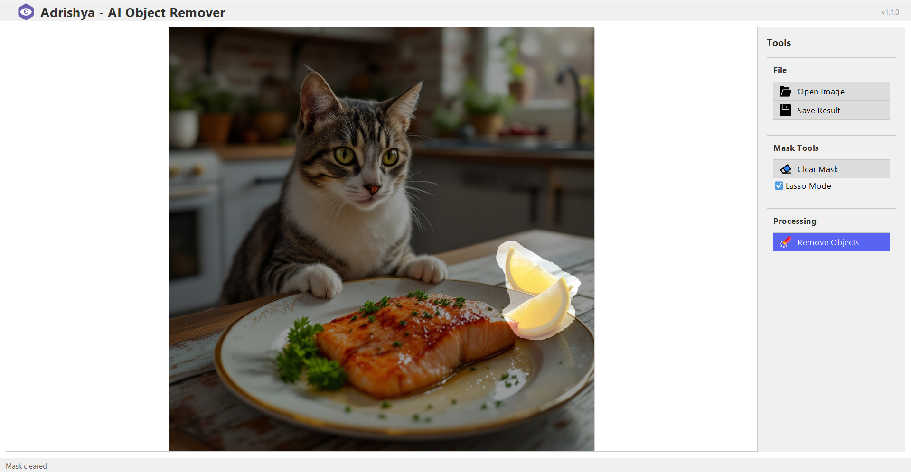

# Adrishya AI - Image Object Remover

Adrishya AI is a Java-based IntelliJ project that removes unwanted objects from images without quality loss. It uses OOP concepts, a sleek FlatLaf UI, MySQL database, and the LAMA AI model via ONNX Runtime for fast, accurate, and seamless object removal.

---

## Features
- Lossless removal of unwanted objects from images  
- Java backend built with Object-Oriented Programming (OOP) principles  
- Modern FlatLaf UI for a smooth user experience  
- MySQL database for efficient data management  
- Powered by LAMA AI model using ONNX Runtime for precise editing  
- Developed as an IntelliJ IDEA project  

---

## Demo Image

  
 
*Example of object removal using Adrishya AI*

---

## Demo Video

<video width="640" height="360" controls>
  <source src="./assets/demo-video.mp4" type="video/mp4">
  Your browser does not support the video tag.
</video>

---

## Requirements
- Java 11 or higher  
- IntelliJ IDEA  
- Python with pip installed  
- MySQL server running  

---

## Setup & Run Instructions

1. Ensure **Python with pip** is installed on your system.

2. Download the LAMA AI model from the link below:  
   🔗 [Download LAMA AI Model](https://drive.google.com/file/d/1Bvm5PE93j4zBys0oz1SwM6CYReroV87p/view?usp=sharing)

3. Place the downloaded model file in the `src` directory, **in the same folder as `MainApp.java`**.

4. Open your terminal or command prompt and navigate to the project directory:  
   ```bash
   cd path/to/AdrishyaAI

Install the required Python packages:

```bash
pip install -r requirements.txt
Open the project in IntelliJ IDEA.
```

1. In IntelliJ, open the MainApp.java file and run the project.The GUI window will open.
2. Load the image you want to edit.
3. Use the Lasso Selection tool to easily select the object you want to remove.
